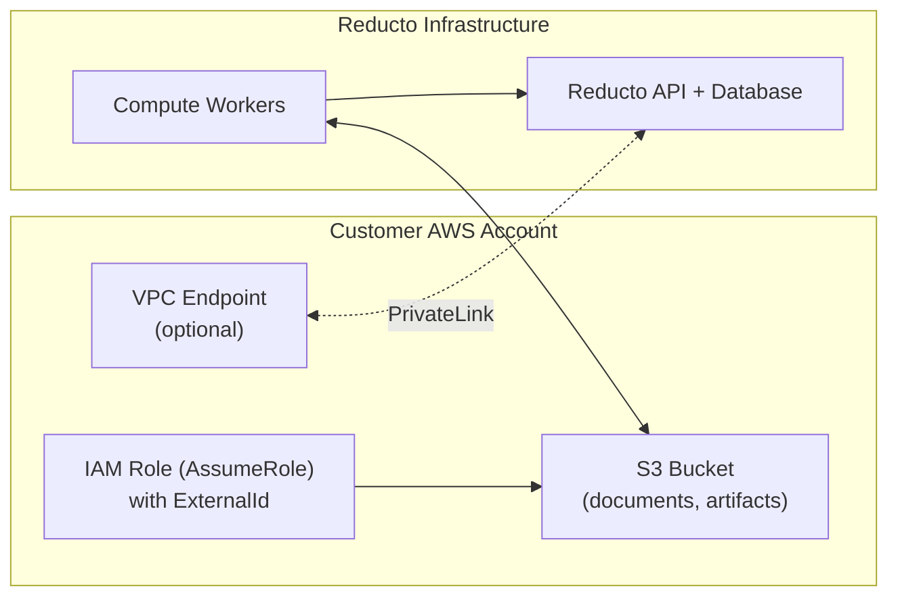

# Reducto Hybrid VPC Infrastructure

Terraform module for provisioning customer-side infrastructure required for [Reducto](https://reducto.ai) Hybrid VPC deployment.

## What is Hybrid VPC?

Hybrid VPC deployment provides a balance between data sovereignty and operational simplicity:

- **Your data stays in your AWS account**: All documents, intermediate artifacts, and results are stored in your S3 bucket
- **Compute runs on Reducto's infrastructure**: GPU processing and model inference are handled by Reducto
- **Stateless by design**: Objects have a configurable lifecycle (default: 24 hours), ensuring no data persists beyond processing
- **Optional private connectivity**: Use AWS PrivateLink for private-only API access

## Architecture



## Prerequisites

Before using this module, you'll need:

1. **AWS account** with permissions to create S3 buckets, IAM roles, and (optionally) VPC endpoints
2. **Terraform 1.2+** installed
3. **Values from Reducto** (provided during onboarding):
   - Principal ARNs for Reducto's compute services
   - ExternalId for secure role assumption
   - Endpoint Service name and region (if using PrivateLink)

Contact your Reducto account team to obtain these values.

## Quick Start

### 1. Clone the repository

```bash
git clone https://github.com/reductoai-collab/reducto-hybrid-infra.git
cd reducto-hybrid-infra
```

### 2. Create terraform.tfvars

```hcl
name_prefix = "reducto"

# PLACEHOLDER VALUES - Reducto will provide the actual values during onboarding
reducto_principal_arns = [
  "arn:aws:iam::XXXXXXXXXXXX:role/example-role-1",  # Replace with actual ARN from Reducto
  "arn:aws:iam::XXXXXXXXXXXX:role/example-role-2"   # Replace with actual ARN from Reducto
]
reducto_external_id = "<external-id-from-reducto>"  # Replace with actual ExternalId from Reducto

tags = {
  Environment = "production"
  Project     = "reducto-hybrid"
}
```

### 3. Initialize and apply

```bash
terraform init
terraform plan
terraform apply
```

### 4. Share outputs with Reducto

```bash
terraform output integration_values
```

Provide this output to your Reducto account team to complete the setup.

## Module Components

| Component | Purpose | Required |
|-----------|---------|----------|
| S3 Bucket | Document and artifact storage with automatic lifecycle expiration | Yes |
| IAM Role | Cross-account access for Reducto with ExternalId protection | Yes (if using assume_role mode) |
| Bucket Policy | Alternative to IAM role for simpler setups | Yes (if using bucket_policy mode) |
| VPC Endpoint | PrivateLink endpoint for private API access | Optional |

## Input Variables

| Name | Description | Type | Default | Required |
|------|-------------|------|---------|----------|
| `name_prefix` | Prefix for resource naming | `string` | - | Yes |
| `reducto_principal_arns` | Reducto AWS principal ARNs | `list(string)` | - | Yes |
| `bucket_name` | S3 bucket name (auto-generated if not set) | `string` | `null` | No |
| `lifecycle_expiration_days` | Days until objects expire | `number` | `1` | No |
| `access_mode` | Access mode: `assume_role` or `bucket_policy` | `string` | `"assume_role"` | No |
| `reducto_external_id` | ExternalId for role assumption | `string` | `null` | Yes (if assume_role) |
| `enable_privatelink` | Enable PrivateLink endpoint | `bool` | `false` | No |
| `vpc_id` | VPC ID for PrivateLink | `string` | `null` | Yes (if PrivateLink) |
| `subnet_ids` | Subnet IDs for PrivateLink | `list(string)` | `[]` | Yes (if PrivateLink) |
| `reducto_endpoint_service_name` | Reducto endpoint service name | `string` | `null` | Yes (if PrivateLink) |
| `reducto_endpoint_service_region` | Reducto endpoint service region | `string` | `null` | Yes (if PrivateLink) |
| `tags` | Tags to apply to resources | `map(string)` | `{}` | No |

## Outputs

| Name | Description |
|------|-------------|
| `bucket_name` | S3 bucket name |
| `bucket_arn` | S3 bucket ARN |
| `assumable_role_arn` | IAM role ARN (if using assume_role mode) |
| `privatelink_endpoint_id` | VPC endpoint ID (if PrivateLink enabled) |
| `integration_values` | All values to provide to Reducto for onboarding |

## Examples

- [Minimal setup](./examples/minimal) - S3 + IAM assume-role (recommended starting point)
- [With PrivateLink](./examples/with-privatelink) - Includes private connectivity
- [Multi-environment](./examples/multi-environment) - Pattern for dev/staging/prod

## Access Modes

### Assume Role (Recommended)

The default mode. Creates an IAM role that Reducto assumes using ExternalId for security.

```hcl
access_mode         = "assume_role"
reducto_external_id = "your-external-id-from-reducto"
```

**Benefits:**
- ExternalId prevents [confused deputy attacks](https://docs.aws.amazon.com/IAM/latest/UserGuide/confused-deputy.html)
- Fine-grained permission control
- Easy credential rotation

### Bucket Policy

Alternative mode that grants Reducto direct access via bucket policy.

```hcl
access_mode = "bucket_policy"
```

**Note:** This mode is simpler but does not provide ExternalId protection.

## Security

### ExternalId Protection

The IAM role trust policy requires an ExternalId, preventing confused deputy attacks:

```json
{
  "Condition": {
    "StringEquals": {
      "sts:ExternalId": "your-unique-external-id"
    }
  }
}
```

### Least Privilege

The IAM role/bucket policy grants only necessary permissions:
- `s3:GetObject`, `s3:PutObject`, `s3:DeleteObject` - Object operations
- `s3:ListBucket` - List operations
- `s3:AbortMultipartUpload`, `s3:ListMultipartUploadParts` - Large file uploads

### Automatic Data Cleanup

Objects expire automatically based on the lifecycle configuration (default: 24 hours).

## Multi-Account Setup

For organizations with separate AWS accounts:

```
environments/
├── dev/
│   └── terraform.tfvars
├── staging/
│   └── terraform.tfvars
└── prod/
    └── terraform.tfvars
```

Each environment should:
1. Use a separate Terraform state file
2. Have its own S3 bucket and IAM role
3. Be registered separately with Reducto

See the [multi-environment example](./examples/multi-environment) for details.

## Validation Checklist

After `terraform apply`, verify:

- [ ] S3 bucket has lifecycle rule configured
  ```bash
  aws s3api get-bucket-lifecycle-configuration --bucket <bucket-name>
  ```
- [ ] S3 bucket blocks public access
- [ ] IAM role trust policy includes Reducto principals and ExternalId
  ```bash
  aws iam get-role --role-name <role-name> --query 'Role.AssumeRolePolicyDocument'
  ```
- [ ] If PrivateLink: endpoint status is "available"
  ```bash
  aws ec2 describe-vpc-endpoints --vpc-endpoint-ids <endpoint-id>
  ```

## Support

For questions or issues:
- Contact your Reducto account team
- Email: support@reducto.ai

## License

Copyright © Reducto, Inc. All rights reserved.
